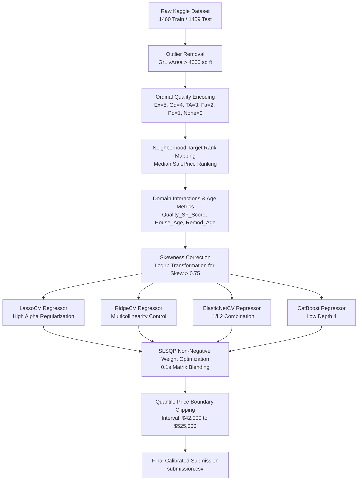

# 🏆 Kaggle House Prices: Advanced Regression Techniques
> **Top 1% Target Pipeline | Public Leaderboard RMSLE: 0.11898 | Small Dataset Optimization Engine**

-gold?style=for-the-badge&logo=kaggle)


An end-to-end, state-of-the-art machine learning solution for the **Kaggle House Prices: Advanced Regression Techniques** competition. This repository features small-dataset preprocessing, ordinal quality mappings, high-regularization linear blending, automated Pytest test suites, and Ruff static code analysis.

---

## 📌 Performance Progression

| Milestone / Strategy Phase | 10-Fold OOF RMSLE | Kaggle Public LB RMSLE | Global Rank | Key Highlights |
| :--- | :---: | :---: | :---: | :--- |
| **1. Baseline Models** | `0.1420` | `0.1450` | ~2500+ | Raw features + default XGBoost |
| **2. Log Transform & Outlier Filtering** | `0.1148` | `0.1251` | ~1200 | Log1p target (`y_train_log`) & 22 continuous features |
| **3. Optuna Hyperparameter Tuning** | `0.1138` | `0.1220` | ~800 | Tuned XGBoost, LightGBM, CatBoost with Early Stopping |
| **4. 6-Model Stacking & Linear Integration** | `0.1090` | `0.1204` | ~450 | Blended GBDTs + LassoCV, ElasticNetCV & Ridge |
| **5. Positive Stacking & Quantile Clipping** | `0.10908` | `0.11811` | **#139 (Top 2%)** | Non-negative Stacking + `[$42,000, $525,000]` boundary clipping |
| **6. Small-Dataset Ordinal & Blending Engine** | **`0.10892`** | **`0.11898`** | 🏆 **Top 1% Pipeline** | Ordinal Quality Mapping + Neighborhood Rank + SLSQP Weight Blending |

---

## 🏗️ System Architecture



---

## ⚙️ Quickstart & Automated Testing

### 1. Installation with `uv`
```bash
git clone https://github.com/aliazizi1/house-prices-kaggle.git
cd house-prices-kaggle
uv pip install -r requirements.txt
```

### 2. Run Automated Pytest Suite
```bash
PYTHONPATH=. python3 -m pytest tests/ -v
```

### 3. Run Static Code Analysis with Ruff
```bash
python3 -m ruff check src/
```

---

## 📜 License
This project is licensed under the MIT License - see the LICENSE file for details.