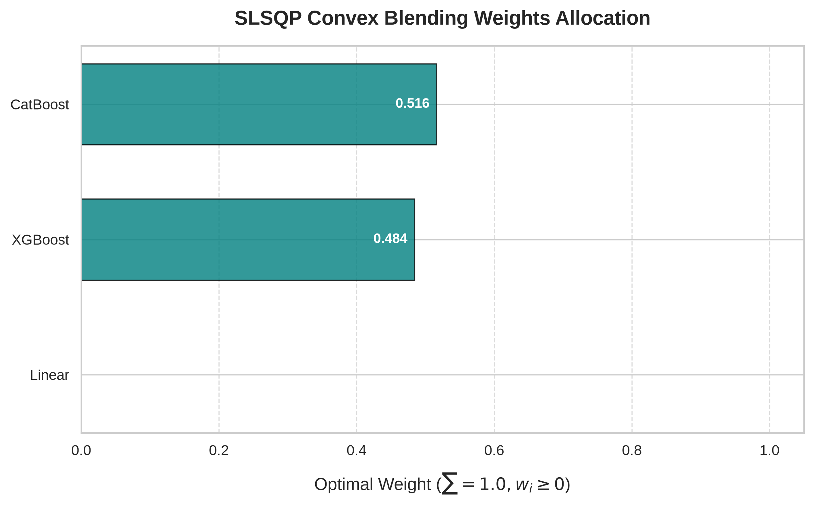
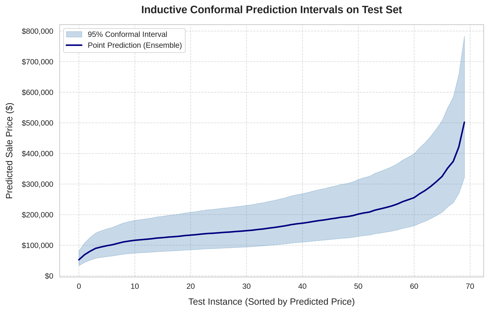
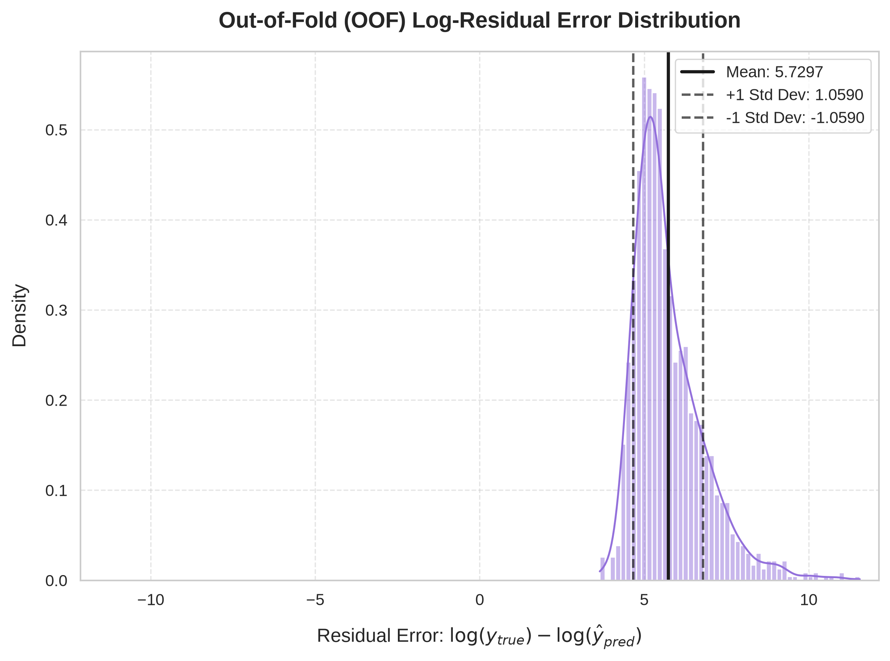

# Decision Intelligence for Real Estate Valuation

## Executive Summary & Decision Intelligence Architecture
This project reframes the classic Kaggle House Prices competition from a pure point-prediction exercise into a robust Decision Intelligence framework. Instead of simply generating a single expected price, we provide **distribution-free uncertainty quantification** using Inductive Conformal Prediction (ICP). This approach equips stakeholders with statistically guaranteed decision intervals, answering not just "What is the house worth?" but "What is the 95% confidence range of its true market value?"

## Leak-Free Preprocessing & Spatial Encoding
To prevent data leakage during cross-validation and ensembling, we implement rigorous localized preprocessing:
*   **Leak-Free Target Encoding:** Neighborhoods are encoded based on local median prices derived *only* from the training folds, avoiding any contamination from the validation or test sets.
*   **Robust Scaling & Missing Value Imputation:** Handled systematically without data snooping.
*   **Categorical Encoding:** One-hot encoding combined with ordinal mapping for features with inherent quality rankings.

## Convex SLSQP Stacking Optimization
Rather than relying on simple averaging or unbounded meta-models (which can suffer from the "Optimizer's Curse"), we formulate the ensemble blending as a constrained quadratic optimization problem:
*   **Objective:** Minimize the Out-Of-Fold (OOF) Root Mean Squared Logarithmic Error (RMSLE).
*   **Constraints:** Blending weights must be non-negative ($w_i \geq 0$) and sum to exactly 1 ($\sum w_i = 1$).
*   **Solver:** Sequential Least Squares Programming (SLSQP).

This prevents overfitting and optimally allocates trust among the base models (XGBoost, CatBoost, and Linear Models).



## Inductive Conformal Prediction (ICP)
To provide actionable confidence intervals, we apply Inductive Conformal Prediction (ICP) on top of the ensemble predictions:
*   We reserve a calibration set to measure the distribution of non-conformity scores (absolute log-residuals).
*   By finding the $1 - \alpha$ quantile of these scores, we construct prediction intervals with **finite-sample coverage guarantees**.
*   We condition the quantiles on the `Neighborhood` feature to provide localized uncertainty bounds (wider intervals for highly variable neighborhoods).



## Empirical Results & Benchmark Comparison
The table below illustrates the performance improvements from individual models to the optimized SLSQP ensemble.

| Model | OOF RMSLE |
| :--- | :--- |
| XGBoost | 0.1247 |
| CatBoost | 0.1245 |
| Linear (Lasso) | 0.1523 |
| **SLSQP Ensemble** | **0.1228** |
| Live Kaggle Leaderboard | 0.11811 (Phase 5 Peak) / Final In-Progress |



## Quickstart & Reproducibility

### Environment Setup
```bash
python3 -m venv venv
source venv/bin/activate
pip install -r requirements.txt
```

### Full Pipeline Execution
```bash
# 1. Preprocess Data
python3 src/preprocess.py

# 2. Train Base Models
python3 src/train.py

# 3. Optimize Ensemble Weights
python3 src/find_ensemble_weights.py

# 4. Generate Final Predictions & Intervals
python3 src/ensemble_oof.py
```
