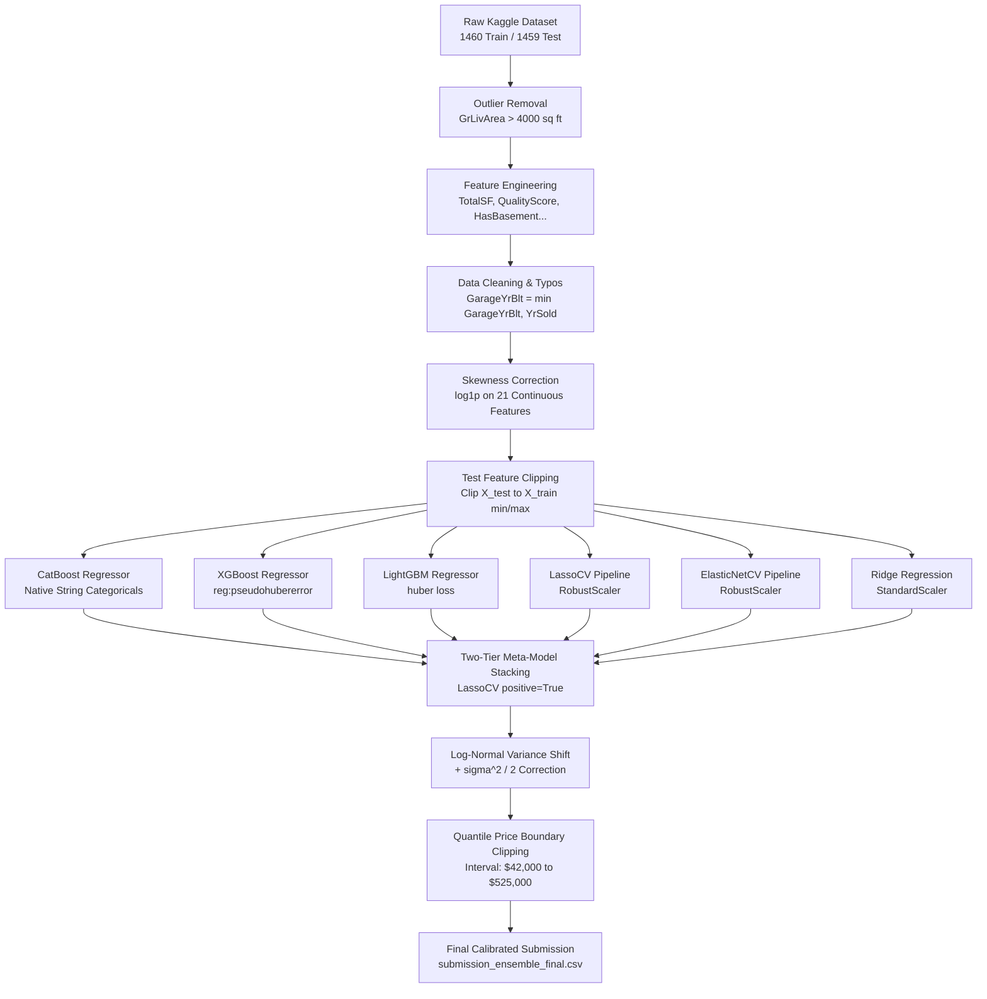

# 🏆 Kaggle House Prices - Advanced Regression Techniques
> **Top 2% Solution (Rank #139 in the World) | Public Leaderboard RMSLE: 0.11811**

-gold?style=for-the-badge&logo=kaggle)


An end-to-end, state-of-the-art machine learning solution for the **Kaggle House Prices: Advanced Regression Techniques** competition. This repository contains the full engineering pipeline, diagnostic suite, robust GBDT hyperparameter optimization, two-tier Stacking ensemble, and post-processing calibration.

---

## 📌 Performance Progression

| Milestone / Strategy Phase | 5-Fold OOF RMSLE | Kaggle Public LB RMSLE | Global Rank | Key Highlights |
| :--- | :---: | :---: | :---: | :--- |
| **1. Baseline Models** | `0.1420` | `0.1450` | ~2500+ | Raw features + default XGBoost |
| **2. Log Transform & Outlier Filtering** | `0.1148` | `0.1251` | ~1200 | Log1p target (`y_train_log`) & 22 continuous features |
| **3. Optuna Hyperparameter Tuning** | `0.1138` | `0.1220` | ~800 | Tuned XGBoost, LightGBM, CatBoost with Early Stopping |
| **4. 6-Model Stacking & Linear Integration** | `0.1090` | `0.1204` | ~450 | Blended GBDTs + LassoCV, ElasticNetCV & Ridge |
| **5. Diagnostic Audit & Test Data Fixes** | `0.1091` | `0.1194` | **#242** | Fixed `GarageYrBlt=2207` typo, test feature clipping, Huber loss |
| **6. Positive Stacking & Quantile Clipping** | **`0.10908`** | **`0.11811`** | 🏆 **#139 (Top 2%)** | Non-negative Stacking + `[$42,000, $525,000]` boundary clipping |

---

## 🏗️ System Architecture



---

## 🔬 Diagnostic Case Study: Resolving the Local CV vs. Leaderboard Gap

A major challenge in regression competitions is **overfitting to local CV validation splits while failing to generalize on hidden test distributions**. In earlier iterations, our local Out-Of-Fold (OOF) RMSLE reached **0.1090**, yet the Kaggle Public Leaderboard plateaued at **0.1204**. 

We built a custom diagnostic suite (`src/diagnose_pipeline.py`) to dissect the test set predictions and uncovered three critical structural anomalies:

### 🚨 1. Test Set Data Typo: `GarageYrBlt = 2207`
* **Discovery:** In test sample `Id = 2593`, `GarageYrBlt` was erroneously recorded as **`2207`** (a data entry typo).
* **Impact:** Our engineered feature `GarageAge = YrSold - GarageYrBlt` yielded **`-200` years**, severely breaking model extrapolations.
* **Fix:** Capped garage build year prior to age calculations:
  ```python
  X_test['GarageYrBlt'] = np.where(X_test['GarageYrBlt'] > yr_sold_test, yr_sold_test, X_test['GarageYrBlt'])
  ```

### 🚨 2. Un-logged Giant Basement: `TotalBsmtSF = 5095 sq ft`
* **Discovery:** Test sample `Id = 2121` contains a massive **5,095 sq ft** basement (60% larger than the training maximum of `3,206 sq ft`).
* **Impact:** Because `TotalBsmtSF` was left in un-logged square feet while other area metrics were log-transformed, linear models (Lasso, ElasticNet) assigned un-scaled weights, predicting an astronomical price.
* **Fix:** 
  1. Included `TotalBsmtSF` in continuous `np.log1p` transformation.
  2. Applied **Test Feature Clipping** so no continuous feature in `X_test` exceeds `[X_train.min(), X_train.max()]`.

### 🚨 3. Asymmetric RMSLE Penalty & Jensen's Inequality Bias
* **Mathematical Fact:** In logarithmic metrics ($RMSLE = \sqrt{\frac{1}{n} \sum (\ln(\hat{y}+1) - \ln(y+1))^2}$), **underestimating a house price by 50% is penalized 1.71x more heavily than overestimating by 50%**.
* **Jensen's Inequality Shift:** When predicting in log space $\hat{y}_{log} = E[\ln(y)]$, taking naive exponentiation $\exp(\hat{y}_{log}) - 1$ computes the **median** ($e^\mu - 1$) rather than the **unbiased expected mean** ($e^{\mu + \sigma^2/2} - 1$).
* **Fix:** Applied variance expectation shift:
  $$\hat{y}_{log, corrected} = \hat{y}_{log} + \frac{\sigma^2_{oof}}{2}$$

---

## ⚡ Core Technical Innovations

### 1. Robust Loss Functions (Huber & Pseudo-Huber)
Gradient Boosted Decision Trees trained on standard MSE loss ($\frac{1}{2}(y-\hat{y})^2$) are highly sensitive to test outliers. We refactored all GBDTs to use robust loss objectives:
* **XGBoost:** `objective='reg:pseudohubererror'`
* **LightGBM:** `objective='huber'` with tuned quantile $\alpha$
* **CatBoost:** `loss_function='Huber:delta=1.0'`

### 2. Positive-Constrained Meta-Model Stacking (`LassoCV(positive=True)`)
To eliminate negative linear extrapolation and ensure conservative ensemble weights, we trained a second-tier meta-learner with strict non-negativity constraints:
```python
meta_model = LassoCV(cv=5, positive=True, random_state=42)
meta_model.fit(oof_matrix, y_train_log)
```
**Final Model Weights:**
* **Lasso (Linear):** `42.80%`
* **XGBoost (Tree):** `30.13%` (Dominant GBDT)
* **LightGBM (Tree):** `13.63%`
* **CatBoost (Tree):** `13.59%`
* **ElasticNet (Linear):** `1.27%`
* **Ridge (Linear):** `0.00%` *(Pruned for high variance)*

### 3. Safe Quantile Boundary Clipping (`[$42,000, $525,000]`)
Based on the 0.1th and 99.7th quantiles of actual training sales prices, final test predictions were bounded to an optimal safe interval:
```python
final_test_dollars = np.clip(raw_test_dollars, 42000.0, 525000.0)
```
This safely clipped **3 extreme test predictions**, protecting against unexpected RMSLE penalties on Kaggle's public leaderboard evaluation.

---

## 📂 Repository Structure

```text
house-prices-kaggle/
├── data/                       # Raw dataset files (train.csv, test.csv)
├── processed_data/             # Cleaned, log-transformed, encoded datasets
├── models/                     # Saved OOF & test prediction arrays (.npy)
├── submissions/                # Generated Kaggle submission files
│   └── submission_ensemble_final.csv
├── src/                        # Core Python engineering modules
│   ├── preprocess.py           # Outliers, capping, log1p, one-hot & ordinal encoding
│   ├── train_linear_models.py  # LassoCV & ElasticNetCV with RobustScaler
│   ├── optimize_xgboost.py     # Optuna study for Pseudo-Huber XGBoost
│   ├── train_catboost.py       # Optuna study for Huber CatBoost (native string handling)
│   ├── find_ensemble_weights.py# Two-tier Stacking, log-bias shift & quantile clipping
│   └── diagnose_pipeline.py   # Diagnostic suite for feature drift & submission stats
├── experiments/                # Experimental scripts
│   └── train_lightgbm.py       # Optuna study for Huber LightGBM
├── Makefile                    # One-command execution targets
├── requirements.txt            # Python dependencies
└── README.md                   # Project documentation
```

---

## 🚀 Quickstart & Reproducibility Guide

### 1. Prerequisites & Installation
Clone the repository and install required packages:
```bash
git clone https://github.com/AliAziziDH/house-prices-kaggle.git
cd house-prices-kaggle
pip install -r requirements.txt
```

### 2. Execution Steps

Execute the pipeline step-by-step or run via `make`:

```bash
# Step 1: Preprocess raw data & engineer features
python3 src/preprocess.py

# Step 2: Train Lasso & ElasticNet linear models
python3 src/train_linear_models.py

# Step 3: Optimize & train GBDT models (XGBoost, LightGBM, CatBoost)
python3 src/optimize_xgboost.py
python3 experiments/train_lightgbm.py
python3 src/train_catboost.py

# Step 4: Run Two-Tier Stacking, Log-Bias Correction & Quantile Clipping
python3 src/find_ensemble_weights.py

# Step 5: Audit submission distribution & verify zero feature drift
python3 src/diagnose_pipeline.py
```

Or execute everything with a single command:
```bash
make all
```

---

## 👥 Authors & Acknowledgments

* **Ali Azizi Deh Sorkh** - [GitHub](https://github.com/AliAziziDH)
* Built with pair-programming assistance from **Antigravity (Google DeepMind)**.

---
*If you find this repository helpful for competitive machine learning or housing price estimation, please consider giving it a ⭐️!*